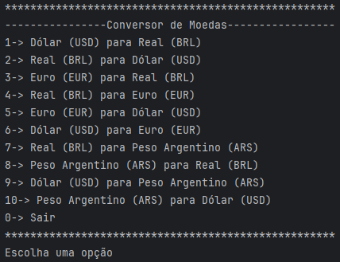

# Conversor de Moedas

 
Conversor de moedas feito em Java que utiliza a ExchangeRate-API para obter as taxas de câmbio em tempo real e a biblioteca Gson para manipular JSON.

## Interface do Projeto

## Como funciona

Depois de escolhida a opção, basta digitar o valor que deseja converter e o resultado será impresso no terminal.